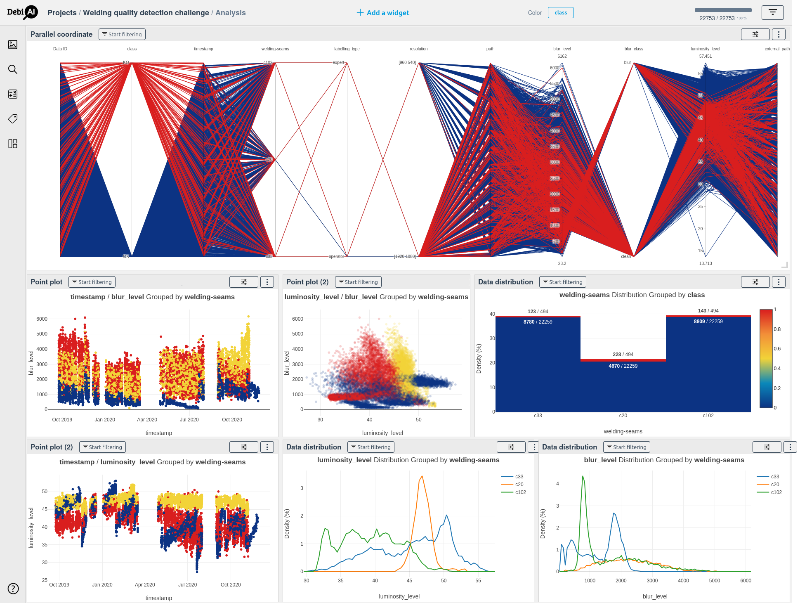
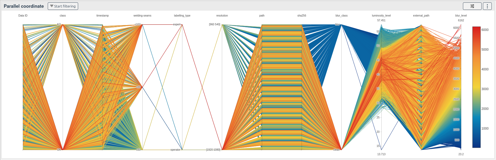

# Welding Quality Detection - Confiance.AI Challenge

## Metadata Analysis with DebiAI

<div align="center">
    
    <br>
    This dataset is available on the <a href="https://demo.debiai.fr/#/">DebiAI demo</a> instance.

</div>

## About the Challenge

[Welding Quality Detection Challenge](https://confianceai.github.io/Welding-Quality-Detection-Challenge/)  
Organized by the **Confiance.ai community** and **IRT SystemX**, with support from the **Renault Group**.

<div align="center">
    
</div>

This challenge is part of the European Trustworthy AI initiative, led by Confiance.ai.  
Its mission is to promote **responsible industrial AI** and make Confiance.ai methodologies a European and global benchmark for trustworthy AI.

- [Challenge website](https://confianceai.github.io/Welding-Quality-Detection-Challenge/)
- [Dataset information](https://confianceai.github.io/Welding-Quality-Detection-Challenge/docs/dataset/)

## What is DebiAI?

[DebiAI](https://debiai.irt-systemx.fr/) is an **open-source web app** that simplifies machine learning workflows through:

- Data exploration & visualization
- Outliers & bias detection
- Model results and performance contextual comparison
- Real-time interaction with your datasets

<div align="center">
    <a href="https://debiai.irt-systemx.fr/">
        Visit the DebiAI website (docs + tutorials)
    </a>
</div>

## Analyzing the Welding Dataset with DebiAI

This repository provides a **Data-provider** for the Welding Detection Challenge Metadata: [`data_provider.py`](data_provider.py)

It allows you to load the dataset into DebiAI for visual analysis and quality checks.  
Learn more about Data-providers: [DebiAI Data Insertion Guide](https://debiai.irt-systemx.fr/dataInsertion/dataProviders/)

### `debiai_data_provider` Python Module

The provider is based on [`debiai_data_provider`](https://github.com/debiai/easy-data-provider) – a simple module to serve data to DebiAI.

## Setup Instructions

### 1. Clone the repository

```bash
git clone https://github.com/debiai/use-cases.git DebiAI-use-cases
cd DebiAI-use-cases/weldingQuality
```

### 2. Install dependencies

```bash
pip install -r requirements.txt
```

### 3. Run the Data-provider

```bash
python data_provider.py
```

Expect the following output:

```bash
% python data_provider.py

Loading data from parquet file
╭──────────────────────── DebiAI Data Provider v1.0.2 ─────────────────────────╮
│ The Data Provider is being started...                                        │
│                                                                              │
│ API Server: http://0.0.0.0:8000                                              │
│ Number of Projects: 1                                                        │
╰──────────────────────────────────────────────────────────────────────────────╯
Loading data from parquet file
┏━━━━━━━━━━━━━━━━━━┳━━━━━━━━━━━━━━━━━━━━━━━━━━━━━━━━━━━━━━━━━━━━━━━━━━━━━━━━━━━┓
┃ Welding quality… ┃ Created: 2025-03-20                                       ┃
┡━━━━━━━━━━━━━━━━━━╇━━━━━━━━━━━━━━━━━━━━━━━━━━━━━━━━━━━━━━━━━━━━━━━━━━━━━━━━━━━┩
│       Structure: │                                                           │
│            class │ auto context                                              │
│        timestamp │ auto context                                              │
│    welding-seams │ auto context                                              │
│   labelling_type │ auto context                                              │
│       resolution │ auto context                                              │
│             path │ auto context                                              │
│           sha256 │ auto context                                              │
│     storage_type │ auto context                                              │
│      data_origin │ auto context                                              │
│       blur_level │ auto context                                              │
│       blur_class │ auto context                                              │
│ luminosity_level │ auto context                                              │
│    external_path │ auto context                                              │
│                  │                                                           │
│      NB samples: │ 22753                                                     │
│                  │                                                           │
└──────────────────┴───────────────────────────────────────────────────────────┘
INFO:     Started server process [22314]
INFO:     Waiting for application startup.
INFO:     Application startup complete.
INFO:     Uvicorn running on http://0.0.0.0:8000 (Press CTRL+C to quit)
```

In a **new terminal**, run:

```bash
debiai-gui start -dp http://localhost:8000
```

A browser tab will open with the DebiAI interface.
Your project will be ready to explore!

<div style="text-align: center;">
    
    <br>
    This dataset is available on the <a href="https://demo.debiai.fr/#/">DebiAI demo</a> instance.

</div>

## Learn more

- [DebiAI Dashboard Guide](https://debiai.irt-systemx.fr/dashboard/)
- The [Woodscape UseCase tutorial](../woodscape/README.md) is also a good introduction to DebiAI.

## Got questions or feedback?

[Contact](https://debiai.irt-systemx.fr/meta/contact.html#contact)
