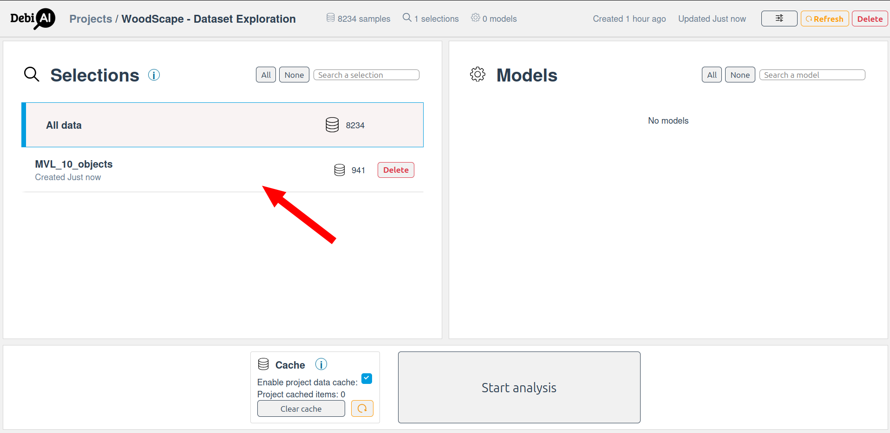

# Confiance.AI Master - DebiAI tutorial

[DebiAI](https://debiai.irt-systemx.fr/) is an open-source web app designed to simplify machine learning development through data analysis, bias/error identification, model performance comparison, and visualization creation.

This tutorial will guide you through the process of setting up DebiAI on your local machine, and using it to analyze the Open source [Woodscape dataset](https://github.com/valeoai/WoodScape)

## Table of Contents

1. [Woodscape dataset download](#woodscape-dataset-download)
2. [DebiAI setup](#debiai-setup)
3. [Project creation](#project-creation)
4. [Images analysis](#images-analysis)
5. [Objects analysis](#objects-analysis)
6. [Dataset creation](#dataset-creation)
7. [Conclusion](#conclusion)

## Woodscape dataset download

The Woodscape dataset is a large-scale dataset for autonomous driving research. It contains a variety of data types, including images, point clouds, and semantic segmentation maps. For this tutorial, we will try to find bias and errors in the Woodscape dataset by using DebiAI.

We will focus on the `box_2d_annotations` folder, which contains 2D bounding box annotations for the dataset. The annotations are stored in JSON format and contain information about the bounding boxes' coordinates, class labels, and other attributes.

In the [Woodscape dataset Google Drive](https://drive.google.com/drive/folders/1X5JOMEfVlaXfdNy24P8VA-jMs0yzf_HR), download the [box_2d_annotations.zip](https://drive.google.com/file/d/1GWIqp5BTXHnu_3uKUTQHzvOVYHu4ZRkC/view?usp=drive_link) file from the [WoodScape_ICCV19](https://drive.google.com/drive/folders/1ltj1QSNQJhThv8DVemM_l-G-GIH3JjMb?usp=drive_link) / [box_2d_annotations](https://drive.google.com/drive/folders/18Dx0BTM_RDdkK3tiyylzktIWl5mfUS3E?usp=drive_link) folder.

Extract the contents of the `box_2d_annotations.zip` file to a folder named `data/box_2d_annotations` in your local machine.

Expected folder structure:

```
data
├── box_2d_annotations
│   ├── 00000_FV.txt
│   ├── 00001_FV.txt
│   ├── 00002_FV.txt
│   ├── 00003_FV.txt
│   ├── 00004_FV.txt
│   ├── 00005_FV.txt
│   ├── 00006_FV.txt
│   ├── 00007_FV.txt
```

## DebiAI setup

To install DebiAI locally, follow one of the methods documented in the [DebiAI WebSite](https://debiai.irt-systemx.fr/introduction/gettingStarted/installation/).

Once you have DebiAI installed and running, you should be able to access the DebiAI web to an empty home page:


DebiAI is now set up and ready to use.

## Project creation

DebiAI provides different ways to create a project, for this tutorial, we will use the `debiai` python package.

[DebiAI Python package Quick start](https://debiai.irt-systemx.fr/dataInsertion/pythonModule/quickStart.html)

```bash
pip install --upgrade debiai
```

Install the other required packages:

```bash
pip install -r requirements.txt
```

To create a new project and upload the Woodscape dataset to DebiAI, run the [debiai_woodscape.ipynb](debiai_woodscape.ipynb) notebook.

At this point, you should have a new project created in DebiAI with the Woodscape dataset uploaded.


## Images analysis

Click on `Start analysis` to analyze the dataset.

Let's start with an empty analysis page by removing all the default widgets.


### Analysis dashboard

The analysis dashboard is the main interface for exploring the dataset and identifying biases and errors. You can add different widgets to the dashboard to visualize the data in various ways.

Here is a description of the different elements of the analysis dashboard:


1. **Project name**: The name of the project being analyzed, select it to return to the project page.
2. **Add a widget button**: Click this button to add a new widget to the dashboard.
3. **Colored columns selector**: Select the column that will be used to color the data points in the different widgets.
4. **Project samples number and selection**: The number of samples in the project and the number of selected samples. When you select samples in a widget, the number of selected samples will be updated here.
5. **Filters menu**: Click this button to open the filters menu, apply new filters or remove existing ones.
6. **Documentation button**: Click this button to open the documentation.

When you click on the `Add a widget` button, a list of available widgets will appear. You can choose the widget you want to add to the dashboard.

Learn more about the dashboard features and advanced features in the [DebiAI documentation](https://debiai.irt-systemx.fr/dashboard/)

### Widget catalog

The widget catalog contains a list of available widgets that you can add to the analysis dashboard:


1. **Widget categories and project types filters**: Use these filters to better find the widget you want to add according to what is needed.
2. **Widget list**: The list of available widgets that can be added to the analysis dashboard. Select a widget to add it to the dashboard.
3. **Widget documentation**: Click on the question mark icon to open the online widget documentation.
4. **Widget configurations**: Some widgets have configurations/preset options that have been defined by the project users. You can select one of these configurations to add the widget with the preselected options.

The full list of available widgets and their documentation can be found in the [DebiAI widgets documentation](https://debiai.irt-systemx.fr/dashboard/widgets/)

### Parallel coordinates widget

The parallel coordinates widget is a powerful tool for visualizing high-dimensional data and identifying patterns and relationships between different features. It will give us a good overview of the Woodscape dataset to see right away if there are any mistakes.

Select the `Parallel coordinates` widget from the widget catalog and add it to the analysis dashboard.

The parallel coordinates widget should be displayed on the dashboard:


1. **Widget title**: The title of the widget. Double-click to edit the title or select `Rename` from the widget menu.
2. **Start Filtering button**: Click this button to start filtering samples graphically. The action required to filter the data points will depend on the widget, not all widgets allow filtering.
3. **Widget settings**: Click on this icon to display / hide the widget settings. The settings will vary depending on the widget.
4. **Widget menu**: Click the three dots icon to open the widget menu. [This page](https://debiai.irt-systemx.fr/dashboard/) describes the different actions available in the widget menu.
5. **Widget settings**: The settings of the widget. The settings will vary depending on the widget. In the case of the parallel coordinates widget, the available columns are displayed here. You can select the columns you want to display by clicking on their labels, then click on the `Validate` button to display the parallel coordinates plot.
6. **Columns category**
7. **A column label**: Click on the label to select the column to display in the parallel coordinates plot. Right-click on the label to open the column menu.
8. **The column unique number of values**: The number of unique values in the column. Click on the number to set the column as the colored column.
9. **The column type**
10. Right click on the widget to open the widget menu (see point `4.`).

**Moving the widget:** You can rearrange the widgets in dashboard by dragging them to a new position by grabbing their title bar. You can also resize the widgets by dragging the bottom left and right corner or by their sides.

Select the columns you want to display in the parallel coordinates plot. Once you have selected the columns, click on the `Validate` button to display the parallel coordinates plot.


We can see from this widget that:

- we have 4 cameras in the dataset
- We have from 0 to 35 objects in the images
- We have from 0 to 25 persons in the images
- We have from 0 to 19 vehicles in the images
- We have from 0 to 10 bicycles in the images
- We have from 0 to 9 traffic lights and signs in the images

Everything seems to be in order, let's set the colored column to `camera` to see if there are any evident differences between the cameras.


No evident differences between the cameras.

### Data distribution widget

Ye are expecting each camera to have a similar number of images, let's check that by adding a `Data distribution` widget to the dashboard.

Select the `Data distribution` widget from the widget catalog and set the X axis to `camera`. Select the `Details` option to see the number of samples per camera.


We can see that the number of samples per camera is similar but not exactly the same. We can see that the `MVR` camera has more samples than the other cameras. This could be due to the camera being used more often or having some images removed by the annotators.

Note that the colors between the widgets are the same.

### Data selection

Let's check that if the images with many objects are not biased on a specific camera.

The Parallel coordinates widget allows you to select data points by dragging the mouse over the plot. Let's select the samples that have 15 or more objects in the image:


After selecting the samples, you can see that the number of selected samples has been updated on the top right corner of the dashboard.

The Data distribution widget will also show that the currently displayed data are not matching the selected samples and will suggest to redraw the data.

In DebiAI, the selected data points are shared between the widgets.

After redrawing the data:


We can see that the `MVL` camera has more samples with 15 or more objects in the image. This could

Note that a `Filter applied` button is now displayed on the top right corner of the distribution widget. You can click on it to see which filter is applied.

### Your turn to explore

Try to gather the following information:

- Which camera has the most vehicles in the images in average?
- What is the number of trafic signs in the images with 10 or more persons for each camera?
- Is it true that the more persons in the image, the less vehicles there are?

## Objects analysis

Let's now focus on the objects in the images.

The objects have been present in the dataset from the start, but only the images where analyzed at the moment. To increase the analysis dimension to the objects, we are gonna use the "Unfolding" feature [(Learn more here)](https://debiai.irt-systemx.fr/dashboard/unfolding/).


1. **Unfolding the objects vertically**: Click this button to unfold the objects vertically. This will increase the analysis dimension to the objects from 8234 images to 72063 objects (as seen in point `3.`).
2. **Unfolded the objects horizontally**: As the objects are stored in a dictionary, you can unfold the objects horizontally to extract the objects' attributes in columns.
3. **Number of objects**: The new number of objects in the dataset. Selecting object will select their corresponding images and vice versa. Note that even if no filter is applied, the number of images has decreased from 8234 to 8190. This is because some images do not have any objects.

So now we have 72063 objects and their attributes to analyze.

here is the distribution of the objects classes in the dataset:

We can see that the dataset is not well balanced, with a lot more vehicles than other classes (~60%) and very few traffic signs (~2%). This could lead to biases in the model training.

### Point plot widget

Let's add a `2D Point plot` widget to the dashboard to see the position of the objects in the images.


Note that this widget has been configured with the object.area as the size of the points and the camera as the color. The opacity has been set to 1 to see the points clearly.

This widget allows us to clearly see the fish-eye effect of the cameras, with the objects making a circle around the center of the image.

However, we can between around 8 objects that are in the center of the image and not following the fish-eye effect. Let select them graphically by clicking on the `Start Filtering` button and drawing a rectangle around them:


The Table widget will show the selected objects:


### Your turn to explore

Try to gather the following information:

- What is each class average area ? For each camera? It seams that one of the has bigger objects than the others.
- Where are positioned the persons and the bicycles in the images? Are they in the same area?
- How many objects have a bounding box area smaller than 500 pixels? How many of them are traffic signs?

## Dataset creation

Now that we have analyzed the dataset, we can create a new dataset that contains only the samples that we are interested in.

Let's select the samples that have 10 or more objects in the image and that are from the `MVL` camera. This dataset can be used to train a model that can detect a large number of objects in the images captured by the `MVL` camera.

This selection contains 941 images and 12256 objects.

On the left menu of the dashboard, click on the `Selection` / `Create a new selection` button to create a new selection containing the selected samples.


Name the selection `MVL_10_objects` and click on the `Create` button.

The new selection will be available in the `Selections` section of the project page.


You can start a new analysis with this selection.

Let's download the selection as a DataFrame. To do this, run the [debiai_woodscape_selection.ipynb](debiai_woodscape_selection.ipynb) notebook.

## Conclusion

In this tutorial, we have learned how to set up DebiAI on our local machine, create a new project, upload the Woodscape dataset, and analyze the dataset to identify biases and errors.

## Going further

The [debiai_woodscape_extra_features](debiai_woodscape_extra_features.ipynb) notebook contains the additional images `contrasts` and `luminance` features that can be explored in DebiAI.
